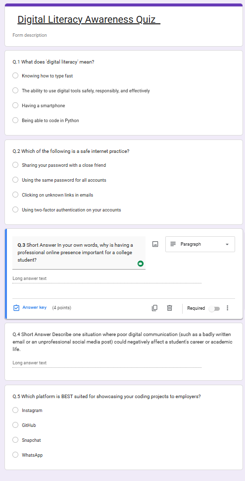
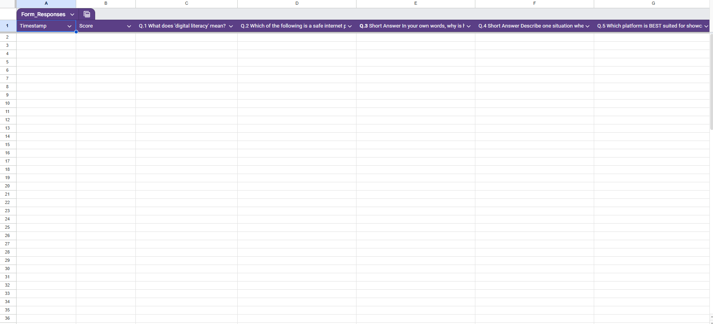

-> Task 3: Digital Literacy Coding & Collaborating Platforms
1. Part A: Digital Problem Solving:-
   Platform Used: HackerEarth

2. Part B: Digital Literacy Quiz:-
   Platforms Used:- Google Forms, Google Sheets
   i) Digital Literacy Awareness Quiz

ii) Attached Sheets for data collection

